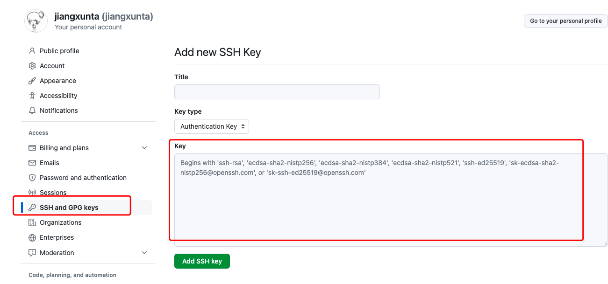

# cd ~/.ssh 
- 报错 -bash: cd: /Users/jiangfufan/.ssh: No such file or directory
- 执行下面命令
```
mkdir ~/.ssh
cd ~/.ssh
```
- .ssh下两个文件夹 id_rsa id_rsa.pub

```
cat id_rsa.pub //查看公钥
cat id_rsa     //查看私钥
```
- 生成新的密钥 SSH key
```
git config --global user.name "fufan"
git config --global user.email "1058759803@qq.com"
```
- 复制 id_rsa.pub 中的所有内容
```
vi id_rsa.pub
```
- 粘贴至github里面 标题随便写 把复制的内容放到key栏里

